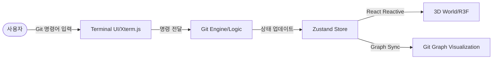

# Git Maze: 3D 시공간 조작 퍼즐 게임 (Notion Presentation)

> **"Git 명령어는 단순한 텍스트가 아니라, 차원을 뒤트는 물리적 법칙이 됩니다."**

---

## 1. 프로젝트 개요 (Overview)

### 🧩 배경 및 동기
Git은 현대 소프트웨어 개발의 필수 도구이지만, 입문자들에게는 브랜치와 병합 같은 개념이 다소 추상적으로 느껴집니다. **Git Maze**는 이러한 추상적인 Git 명령어들을 **3D 미로의 물리적 변화**로 치환하여, 사용자가 직접 미로를 설계하고 차원을 넘나들며 문제를 해결하도록 돕는 차세대 퍼즐 게임입니다.

### 🎮 게임 목표
사용자는 터미널에 익숙한 Git 명령어를 입력하여 막힌 길을 뚫거나, 과거의 시점(Commit)으로 돌아가거나, 병행 우주(Branch)의 지형을 합쳐(Merge) 탈출구에 도달해야 합니다.

---

## 2. 핵심 메타포 (Git as Game Mechanics)

Git의 주요 문법을 게임 내 독창적인 시스템으로 재해석했습니다.

| Git 개념 | 게임 내 기능 | 물리적 현상 |
| :--- | :--- | :--- |
| **Commit** | **시간 박제** | 현재 미로의 상태(플레이어 위치, 지형)를 스냅샷으로 저장합니다. |
| **Branch** | **평행 우주 생성** | 같은 위치에서 시작하지만 서로 다른 미래를 가진 새로운 차원을 만듭니다. |
| **Checkout** | **차원 이동** | 특정 브랜치나 과거의 커밋 시점으로 즉시 이동합니다. |
| **Merge** | **차원 융합** | 두 차원의 지형을 하나로 합칩니다. **(핵심: 구덩이를 다른 차원의 블록으로 메움)** |
| **Reset** | **시간 역행** | 진행 상황을 취소하고 특정 과거 시점으로 돌아갑니다. |

---

## 3. 주요 기술적 특징 (Technical Highlights)

### 🌊 3D 시각화 및 최적화 (Three.js / R3F)
- **InstancedMesh 원칙**: 수천 개의 미로 벽과 바닥 타일을 단일 Draw Call로 렌더링하도록 최적화하여 60FPS를 유지합니다.
- **Islands Theme**: 미로의 바닥이 바다 위에 솟아오른 기둥 형태(Pillar)로 설계되어, 차원의 고립과 연결을 시각적으로 강조합니다.
- **VFX & Animations**: `git checkout` 시 발생하는 **책 넘기기(Page Curl)** 효과와 차원 이동 시의 입자 효과로 몰입감을 높였습니다.

### 💻 터미널 환경 (Xterm.js)
- 실제 개발 환경과 유사한 터미널 UI를 제공합니다.
- 단순한 텍스트 입력이 아닌, 게임 엔진과 실시간으로 통신하는 커스텀 `CommandHandler`를 탑재했습니다.

### 📊 실시간 Git 그래프 (XYFlow)
- 사용자가 생성한 커밋과 브랜치의 계보를 좌측 사이드바에서 시각적으로 확인할 수 있습니다.
- 현재 HEAD의 위치와 브랜치 간의 관계를 직관적으로 파악하여 전략적인 플레이를 유도합니다.

---

## 4. 시스템 아키텍처 (Architecture)

### **Technology Stack**
- **Frontend**: `React` + `Vite` (TypeScript)
- **3D Engine**: `React Three Fiber (R3F)`, `@react-three/drei`
- **State Management**: `Zustand` (핵심 로직 및 UI-3D 동기화)
- **Terminal**: `Xterm.js`
- **Backend**: `Spring Boot`, `PostgreSQL` (스테이지 관리 및 기록 저장)
- **Infrastructure**: `Docker Hub`, `Docker Compose`

### **시스템 흐름도**

---

## 5. 핵심 퍼즐 시스템: 'Dimension Merge'

Git Maze의 가장 큰 재미 요소는 **브랜치 병합(Merge)**을 통한 환경 변화입니다.

1. **A 차원(main)**: 앞에 깊은 구덩이(Pit)가 있어 진행이 불가함.
2. **B 차원(feature)**: 같은 위치에 단단한 블록이 존재함.
3. **해결**: `git merge feature` 입력.
4. **결과**: B 차원의 블록이 A 차원의 구덩이로 소환되어 길이 생성됨.

---

## 6. 성과 및 향후 계획

- **현재 성과**: 핵심 Git 엔진(Commit, Checkout, Merge, Reset) 구현 완료, 실시간 그래프 동기화 및 3D 미로 렌더링 최적화 달성.
- **Next Steps**:
    - **Tutorial Stage Expanded**: 더 복잡한 Git Conflict(충돌) 상황을 퍼즐로 구현.
    - **Multi-layered Level**: 단순 평면 미로가 아닌 다층 구조의 미로 도입.
    - **Stage Editor**: 사용자가 직접 Git 퍼즐을 설계하고 공유하는 커뮤니티 기능.

---

> **Git을 배우는 가장 즐거운 방법, Git Maze에서 시공간을 조작해보세요.**
